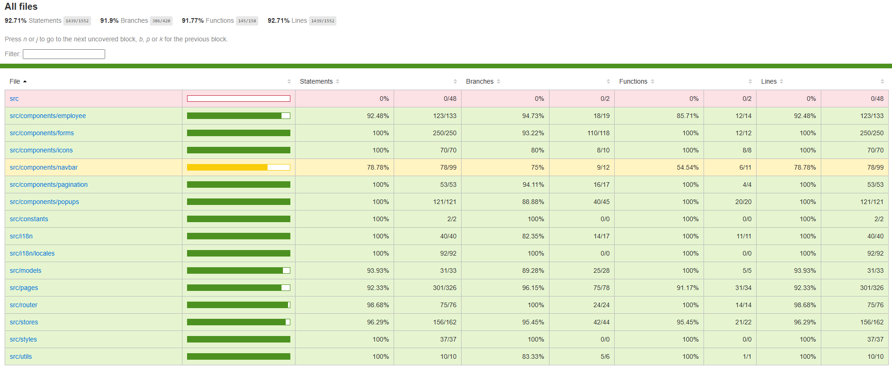

# Employee Management System

A modern, responsive employee management application built with **Lit** web components, **TypeScript**, and **Vite**. Features a clean interface with internationalization support, comprehensive testing, and responsive design.

## 🎥 Demo

### Web Interface
https://user-images.githubusercontent.com/your-user-id/web.mp4

### Mobile Responsive Design
https://user-images.githubusercontent.com/your-user-id/mobile.mp4

> **Note**: To properly display videos in GitHub README, upload the MP4 files through GitHub Issues or Discussions, then copy the generated URLs above.

## ✨ Features

### 🔧 Core Functionality
- **CRUD Operations**: Create, read, update, and delete employee records
- **Dual View Modes**: Toggle between table and grid layouts
- **Pagination**: Efficient navigation through large employee datasets
- **Form Validation**: Comprehensive client-side validation with real-time feedback
- **Responsive Design**: Optimized for desktop, tablet, and mobile devices

### 🌍 Internationalization
- **Multi-language Support**: English and Turkish localizations
- **Dynamic Language Switching**: Change language on-the-fly
- **Localized Validation Messages**: Error messages in user's preferred language

### 🔒 Data Validation
- **Age Verification**: Ensures employees are at least 18 years old
- **Email Validation**: Prevents duplicate emails and validates format
- **Phone Number Validation**: Turkish phone number format validation
- **Date Validation**: Proper date format and logic validation

## 🏗️ Technology Stack

### Frontend
- **[Lit](https://lit.dev/)**: Modern web components framework
- **TypeScript**: Type-safe JavaScript development
- **CSS-in-JS**: Styled components with theme support

### Build Tools
- **[Vite](https://vitejs.dev/)**: Fast build tool and dev server
- **ES Modules**: Modern JavaScript module system
- **Tree Shaking**: Optimized bundle sizes

### Testing
- **[Vitest](https://vitest.dev/)**: Fast unit testing framework
- **JSDOM**: DOM simulation for component testing
- **Coverage Reports**: Comprehensive test coverage analysis

## 📊 Test Coverage

📋 **[View Detailed Coverage Report](coverage/src/index.html)** - Interactive HTML coverage report with line-by-line analysis


## 🚀 Getting Started

### Prerequisites
- **Node.js** (v16 or higher)
- **npm** or **yarn** package manager

### Installation

1. **Clone the repository**
   ```bash
   git clone https://github.com/koglak/employeeManagement.git
   cd employeeManagement
   ```

2. **Install dependencies**
   ```bash
   npm install
   ```

3. **Start development server**
   ```bash
   npm run dev
   ```

4. **Open in browser**
   ```
   http://localhost:5173
   ```

### Available Scripts

| Command | Description |
|---------|-------------|
| `npm run dev` | Start development server with hot reload |
| `npm run build` | Build production bundle |
| `npm run preview` | Preview production build locally |
| `npm run test` | Run unit tests |
| `npm run test:watch` | Run tests in watch mode |
| `npm run test:ui` | Open interactive test UI |
| `npm run test:coverage` | Generate test coverage report |

## 📄 License

This project is licensed under the MIT License - see the [LICENSE](LICENSE) file for details.

## 🙏 Acknowledgments

- **[Lit](https://lit.dev/)** - For providing an excellent web components framework
- **[Vite](https://vitejs.dev/)** - For blazing fast development experience
- **[Vitest](https://vitest.dev/)** - For comprehensive testing capabilities